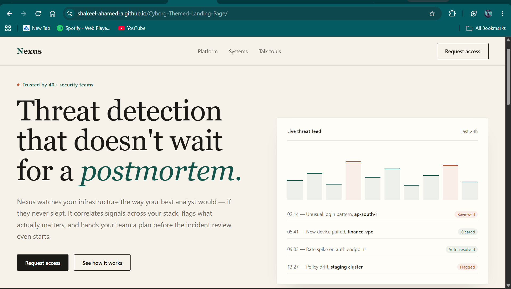

# Cyborg-Themed Landing Page

A responsive cyberpunk/cyborg-themed landing page created as a web-development project for Techfest, IIT Bombay.

## Live Demo

[View the live website](https://shakeel-ahamed-a.github.io/Cyborg-Themed-Landing-Page/)

## Preview



## Overview

This project explores a futuristic cyborg interface using a dark visual system, modern typography, responsive layouts, animated interface elements, and interactive controls.

The page is designed to present a fictional cybernetic system through a combination of visual storytelling and frontend interaction.

## Features

- Responsive landing page design
- Cyborg/cyberpunk visual theme
- Futuristic navigation interface
- Animated central system visualization
- Interactive diagnostic interface
- Telemetry-style information panels
- Multiple content sections
- Responsive mobile navigation
- Desktop, tablet, and mobile layouts
- Smooth scrolling and visual transitions

## Technologies

- HTML5
- CSS3
- JavaScript

## Project Structure

```text
Cyborg-Themed-Landing-Page/
│
├── index.html
└── README.md
